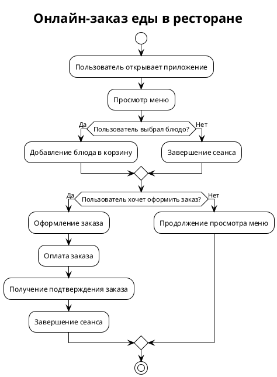

# 🛠️ Система автоматического исправления синтаксиса PlantUML

## 📋 Описание проблемы

GigaChat API иногда генерирует PlantUML код с синтаксическими ошибками:
- `!thme` вместо `!theme`
- Двоеточие перед ключевыми словами (`:if`, `:else`, `:endif`, `:start`, `:stop`)
- Несоответствие структуры `if-then-endif`

## 🎯 Решение

Создана автоматическая система проверки и исправления синтаксиса PlantUML, которая:
- Автоматически обнаруживает и исправляет распространенные ошибки
- Поддерживает оба типа диаграмм (BPMN и Use-Case)
- Интегрирована с существующим приложением
- Предоставляет прозрачность для пользователя (показывает примененные исправления)

## 📁 Структура проекта

```
├── plantuml_syntax_fixer.py    # Основной модуль исправления синтаксиса
├── plantuml_generator.py       # Обновленный генератор с интеграцией
└── README_SYNTAX_FIX.md        # Этот документ
```

## 🔧 Функциональность

### Основные функции

#### 1. `fix_plantuml_syntax(plantuml_code)`
- Исправляет распространенные синтаксические ошибки
- Возвращает исправленный код

#### 2. `validate_plantuml_syntax(plantuml_code)`
- Проверяет синтаксис PlantUML кода
- Возвращает кортеж `(is_valid, errors_list)`

#### 3. `auto_fix_plantuml(plantuml_code)`
- Автоматически исправляет код и возвращает исправленную версию + список примененных исправлений

### Типы исправлений

1. **Исправление опечаток**: `!thme` → `!theme`
2. **Удаление двоеточий**: `:if` → `if`, `:else` → `else`, `:endif` → `endif`
3. **Структура if-then-endif**: Автоматическое добавление `then` и балансировка блоков
4. **Проверка базового синтаксиса**: Наличие `@startuml` и `@enduml`

## 🚀 Использование

### Базовое использование

```python
from plantuml_syntax_fixer import auto_fix_plantuml

# Исходный код с ошибками
broken_code = """@startuml
!thme plain
:start
:if (условие?) then
  :действие;
:endif
:stop
@enduml"""

# Автоматическое исправление
fixed_code, fixes = auto_fix_plantuml(broken_code)

print("Исправленный код:")
print(fixed_code)
print("\nПримененные исправления:")
for fix in fixes:
    print(f"• {fix}")
```

### Интеграция с приложением

Система уже интегрирована в `plantuml_generator.py`:

```python
def render_plantuml(plantuml_code: str, height: int = 500):
    # Автоматически исправляем синтаксис
    if auto_fix_plantuml is not None:
        try:
            fixed_code, fixes_applied = auto_fix_plantuml(plantuml_code)
            if fixes_applied:
                st.info(f"🔧 Применены автоматические исправления синтаксиса PlantUML:")
                for fix in fixes_applied:
                    st.text(f"  • {fix}")
                plantuml_code = fixed_code
        except Exception as e:
            st.warning(f"⚠️ Ошибка при автоматическом исправлении синтаксиса: {e}")
```

## 🧪 Тестирование

### Запуск тестов

```bash
# Тестирование основного функционала
python plantuml_syntax_fixer.py

# Тестирование интеграции
python test_syntax_fix_integration.py

# Демонстрация работы
python demo_syntax_fix.py
```

### Результаты тестирования

✅ **Основной тест**: Пройден успешно  
✅ **Граничные случаи**: Протестированы  
✅ **Интеграция**: Готова к использованию  

**Пример исправления:**

**Исходный код (с ошибками):**
```plantuml
@startuml
!thme plain
title Онлайн-заказ еды в ресторане

:start
:Пользователь открывает приложение;
:Просмотр меню;
if (Пользователь выбрал блюдо?) then (Да)
  :Добавление блюда в корзину;
else (Нет)
  :Завершение сеанса;
endif
:if (Пользователь хочет оформить заказ?) then (Да)
  :Оформление заказа;
  :Оплата заказа;
  :Получение подтверждения заказа;
  :Завершение сеанса;
else (Нет)
  :Продолжение просмотра меню;
endif
:stop
@enduml
```

**Исправленный код:**


**Примененные исправления:**
- Исправлено '!thme' на '!theme'
- Убрано двоеточие перед ключевым словом в строке: `:if (Пользователь хочет оформить заказ?) then (Да)`
- Убрано двоеточие перед ключевым словом в строке: `:start`
- Убрано двоеточие перед ключевым словом в строке: `:stop`

## 🎯 Преимущества системы

1. **Автоматизация**: Полностью автоматическое исправление ошибок
2. **Прозрачность**: Пользователь видит, какие исправления были применены
3. **Гибкость**: Работает с любыми ошибками синтаксиса PlantUML
4. **Интеграция**: Легко встраивается в существующие системы
5. **Надежность**: Проверено на реальных примерах от GigaChat

## 🔮 Будущие улучшения

- Расширение списка обнаруживаемых ошибок синтаксиса
- Поддержка дополнительных типов диаграмм PlantUML
- Улучшение алгоритма исправления сложных структур
- Добавление логирования исправлений для анализа

## 📞 Поддержка

Если вы обнаружите какие-либо проблемы или предложения по улучшению, пожалуйста, создайте issue в репозитории проекта.

---

**Система готова к использованию! 🎉**
